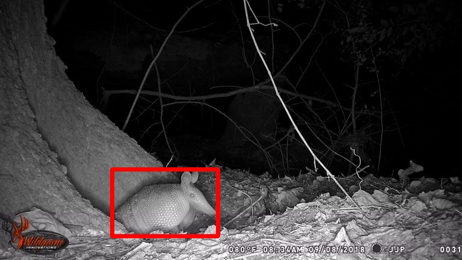
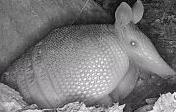

Usage
=============================

We are happy to support users running WildAnimalDetector on their own GPU or CPU, but we recommend that you run WildAnimalDetector on a GPU, as running it on a CPU can be more than 10x slower.

Get WildAnimalDetector
+++++++++++++++++++++++

WildAnimalDetector source code is available `here <https://github.com/yizhen-wang/WildAnimalDetector>`_.

Downloading the model
+++++++++++++++++++++++

The classification and detection models can be downloaded from `Models <https://drive.google.com/drive/folders/1GOiaRIV-OkGDGrgvCp-XvyeWbHvUVwzD?usp=sharing>`_.

Usage Examples
+++++++++++++++++++++++
When using this tool run ‘python main.py -h’ or ‘python main.py --help’ to get the help information.

Currently the following parameters can be used::

  --ImgPath                 The path of the image file.
  --DirPath                 The path of the image dir.
  --Classification_Usage    If classification model will be used to help detection. 
  --WBF_Usage               If Weighted-Boxes-Fusion will be used to help detection. 
  --Output_Dir              Setup the path of output results you want to save. 
  --Draw_Detection          If generating images with detected animals.

You must offer a valid image path or the path of a folder with images, currently we only support ‘.jpg’ and ‘.JPG’ files.

Here are some running commands:

  Basic running::

    python main.py --DirPath <Path to Image Dir>

  Running with draw detection output::

    python main.py --DirPath <Path to Image Dir> --Draw_Detection True
  
  Running with classification and WBF::
    
    python main.py --DirPath <Path to Image Dir> --Draw_Detection True --Classification_Usage True --WBF_Usage True
  
  Running with specific output folder::
    
    python main.py --DirPath <Path to Image Dir> --Output_Dir <Path to Output Dir>

Output Examples
+++++++++++++++++++++++

1.Normal output json file::

  {
    "Armadillo7": [
    {
      "id": 1,
      "bbox": [
        [
          0.2148,
          0.6778, 
          0.4016, 
          0.7958
        ] 
      ],
      "class": "Armadillo",
      "conf": 0.9924 }
    ],
    "Armadillo2": [
    {
      "id": 1,
      "bbox": [
        [
          0.2422,
          0.6505, 
          0.4714, 
          0.9097
        ] 
      ],
      "class": "Armadillo",
      "conf": 0.9932 }
    ] 
  }

2.Image with Detection result:

If ‘--Draw_Detection’ is set to ‘True’, there will be a folder called ‘IMG_WITH_BBOX’ with the images with detected bounding boxes on it.

3.Intermedia result (cropped images) for classification model:

If ‘--Classification_Usage is set to ‘True’, there will be a folder called ‘CROP_IMG’ with the cropped images detected by the detection model.

Example Cropped Image:

